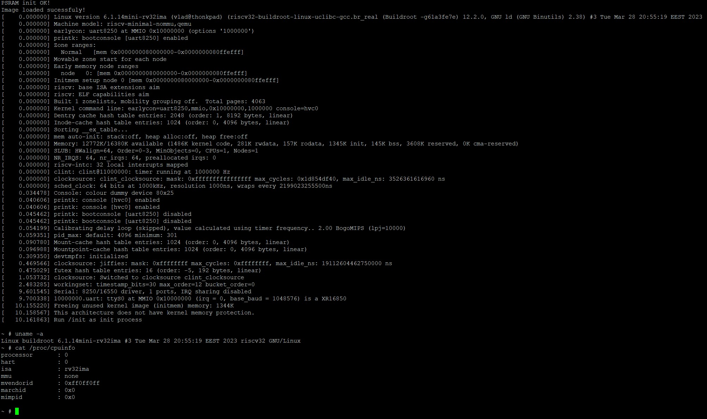

# pico-rv32ima
RISC-V emulator for RP2040, capable of running Linux.\
Based on [mini-rv32ima by CNLohr](https://github.com/cnlohr/mini-rv32ima).

## How it works
This project uses [CNLohr's mini-rv32ima](https://github.com/cnlohr/mini-rv32ima) RISC-V emulator core to run Linux on a Raspberry Pi Pico. It uses two 8 megabyte SPI PSRAM chips as system memory.

## Requirements 
- a Raspberry Pi Pico (or other RP2040 board)
- an SD card
- two 8 megabyte (64Mbit) SPI PSRAM chips (I used LY68L6400).

_This project overvolts and overclocks the RP2040! Use at own risk!_

## How to use
By default, the hardware is configured as follows:
- The SD card is connected via SPI, with the following pinout:
    - CLK: GPIO18
    - MISO: GPIO16
    - MOSI: GPIO19
    - CS: GPIO20

- The two RAM chips are connected with the following pinout:
    - CLK: GPIO10
    - MISO: GPIO12
    - MOSI: GPIO11
    - CS1: GPIO21
    - CS2: GPIO22

- The text console is accessible over USB CDC. 

The hardware and emulator configuration can be modified in the [rv32_config.h](pico-rv32ima/rv32_config.h) file. SDIO interface is also supported for the SD card.

The SD card needs to be formatted as FAT32 or exFAT. I tested block sizes from 1024 to 4096 bytes and they all worked. The Linux kernel and filesystem are provided in the [Image](Image) file (which comes from [this repository](https://github.com/cnlohr/mini-rv32ima-images)). It must be placed in the root of the SD card.

## What it does
On startup, the emulator will copy the Linux image into RAM. After a few seconds, Linux kernel messages will start streaming on the console. The boot process takes about two and a half minutes.
